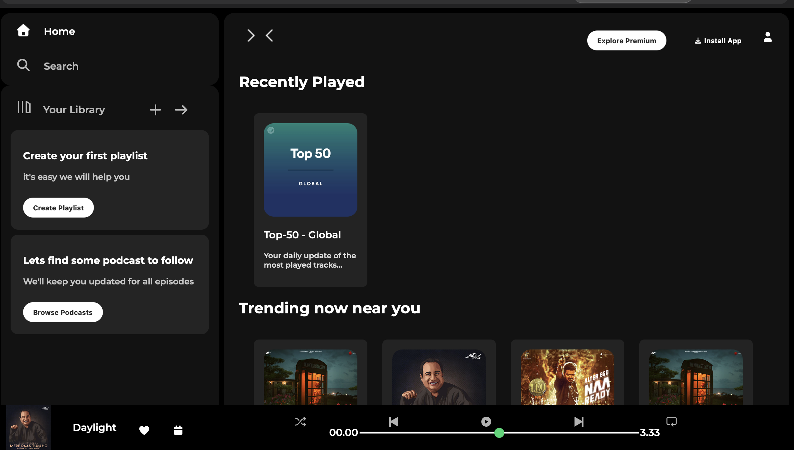

# Spotify Clone

A simple Spotify web clone built using HTML and CSS, replicating the look and feel of Spotify's main interface for learning purposes.

## Features
•⁠  ⁠Responsive landing page
•⁠  ⁠Header with navigation
•⁠  ⁠Song list layout similar to Spotify
•⁠  ⁠Custom CSS styling for buttons and cards

## Tech Stack
•⁠  ⁠HTML5
•⁠  ⁠CSS3 (Flexbox, Grid)

## Screenshot

## Live Demo
https://daman24-hub.github.io/Spotify-Clone/

##  How to Run
1.⁠ ⁠Clone the repository
2.⁠ ⁠Open ⁠ index.html ⁠ in any modern browser

##  Author
DAMAN
GitHub: https://github.com/daman24-hub
